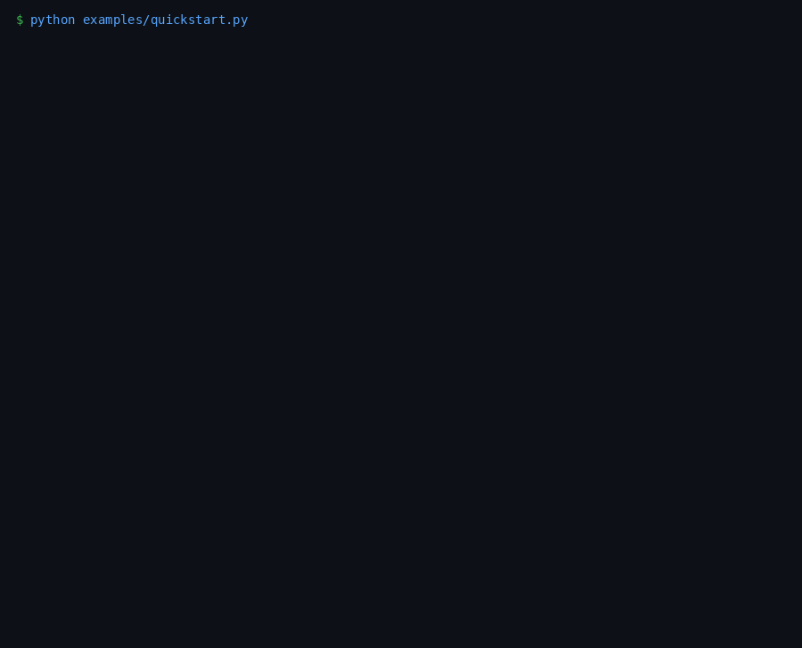
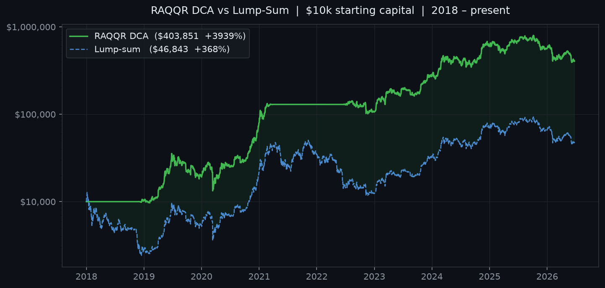

# sdca-raqqr

> **Bitcoin RAQQR Rainbow Valuation + Risk-Scored DCA Backtest Library**


Bitcoin valuation and DCA backtest library. Implements the **RAQQR asymmetric
tail-curvature rainbow** model to score market risk (0–100) and simulate
accumulation/distribution strategies against historical price data.

The numbers this library produces match the reference HTML artifact's default
configuration — proven by a cross-implementation parity test, not assumed.

---



---

## What it does

- **Valuation bands** — computes 7 RAQQR quantile price bands (Q1%→Q99%) for any date from 2009 onward; these are the statistical "rainbow" rails
- **Risk score** — maps today's price against the bands to a 0–100 EQM risk number (low = historically cheap, high = historically expensive)
- **Composite signal** — blends the EQM z-score with optional extra indicators (Sharpe, CBPL) into a single `composite_risk` value
- **DCA backtest** — simulates a piecewise-linear allocation curve: buy X% of cash when risk is low, sell Y% of BTC when risk is high; compares the result against a lump-sum hold

## Install

```bash
# Option 1 — core only (numpy + pandas)
pip install git+https://github.com/azank1/sdca-raqqr.git

# Option 2 — with live Binance fetch
pip install "git+https://github.com/azank1/sdca-raqqr.git[binance]"

# Option 3 — development
git clone https://github.com/azank1/sdca-raqqr.git
cd sdca-raqqr
python -m venv .venv && source .venv/bin/activate
pip install -e ".[binance,dev]"
pytest -q    # 10 tests, all should pass
```

## Quickstart

### Live data (Binance)

```python
import sdca_core as sc

ohlcv = sc.data.load_binance("BTCUSDT")        # fetches full history (~3200 days)
table = sc.analyze(ohlcv)
print(table[["close", "0.01", "0.5", "0.99", "eqm_risk", "composite_risk"]].tail())
```

### Your own CSV

```python
ohlcv = sc.data.load_csv("btc_daily.csv")      # needs at minimum: date, close columns
table = sc.analyze(ohlcv)
```

### Run a DCA backtest

```python
res = sc.backtest_curve(ohlcv, starting_cash=10_000, start="2018-01-01")
print(res.summary())
res.equity_curve.to_csv("equity.csv")
```

Reshape the allocation curve (which % of cash to buy/sell at each risk level):

```python
# values are % of current cash to buy (positive) or % of current BTC to sell (negative)
# at risk nodes 0, 5, 10, ..., 100
sc.backtest_curve(ohlcv, values=[12,12,10,8,4,2,1,0,0,0,0,0,0,0,0,0,-1,-2,-3,-5,-12])
```

## Output

### `sc.analyze()` — valuation table (last 5 rows, Jun 2026)

```
               close          0.01          0.25            0.5           0.75           0.99  eqm_risk  composite_risk
date
2026-06-19  63543.91  63938.641956  90012.406201  113908.267631  133437.020157  199409.480807  1.000000        0.000000
2026-06-20  64298.01  63997.316642  90094.227483  114003.243103  133522.865739  199510.471158  1.241089        0.405927
2026-06-21  63311.99  64056.035788  90176.110051  114098.281404  133608.748152  199611.489452  1.000000        0.000000
2026-06-22  64020.01  64114.799419  90258.053941  114193.382565  133694.667403  199712.535686  1.000000        0.000000
2026-06-23  62647.56  64173.607563  90340.059191  114288.546617  133780.623498  199813.609861  1.000000        0.000000
```

> **Reading the table:** BTC is currently trading *below* the 1% band (~$64k), putting `eqm_risk` at its floor of 1.0 — the model's most extreme "cheap" signal.

### `res.summary()` — backtest result ($10k, Jan 2018 → present)

```
days                 3096.0
buy_days              603.0
sell_days             388.0
no_trade_days        2105.0
starting_cash       10000.0
cash                    0.09
btc                     6.44
portfolio_value    403663.88
pnl                393663.88
return_pct           3936.64
avg_buy_price       15770.51
avg_risk               50.25
lump_value          46821.79
lump_return_pct       368.22
vs_lump            356842.09
vs_lump_pct           762.13
```

## Equity curve — DCA vs Lump-Sum



DCA starting from Jan 2018 with $10,000 at the default curve shape vs buying
and holding the same amount from day one. The green area shows the performance
gap; the gap widens most during high-risk periods where the model sold exposure.

## API reference

| Symbol | Signature | Returns | Description |
|---|---|---|---|
| `analyze` | `analyze(ohlcv, extra_indicators=None)` | `DataFrame` | Bands + all signals in one call |
| `backtest_curve` | `backtest_curve(ohlcv, starting_cash, start, nodes, values)` | `BacktestResult` | Full DCA backtest |
| `raqqr_bands` | `raqqr_bands(index)` | `DataFrame` | 7 band prices + lowRail/highRail |
| `days_since_genesis` | `days_since_genesis(index)` | `ndarray` | t-values since 2009-01-01 |
| `eqm_risk` | `eqm_risk(bands, price)` | `Series` | Risk score 1–99 |
| `eqm_zscore` | `eqm_zscore(bands, price)` | `Series` | Valuation z-score −3…+3 |
| `composite_z` | `composite_z(indicators)` | `Series` | Weighted z-score blend |
| `composite_risk_from_z` | `composite_risk_from_z(z)` | `Series` | z → 0–100 risk |
| `cqm_z_from_risk` | `cqm_z_from_risk(risk)` | `Series` | Risk → CQM z-score |
| `Indicator` | `Indicator(name, z, weight)` | dataclass | Input to composite_z |
| `run_curve_backtest` | `run_curve_backtest(price, risk, ...)` | `BacktestResult` | Low-level backtest |
| `curve_value_at_risk` | `curve_value_at_risk(risk, nodes, values)` | `float` | Interpolate curve at a risk level |
| `CURVE_RISK_NODES` | — | `list[int]` | Default node positions (0, 5, …, 100) |
| `CURVE_DEFAULT_VALUES` | — | `list[float]` | Default buy/sell rates at each node |

`BacktestResult` fields: `days`, `buy_days`, `sell_days`, `no_trade_days`,
`starting_cash`, `cash`, `btc`, `portfolio_value`, `pnl`, `return_pct`,
`avg_buy_price`, `avg_risk`, `avg_rate`, `lump_value`, `lump_return_pct`,
`vs_lump`, `vs_lump_pct`, `equity_curve` (DataFrame).

## How it works

The RAQQR model fits 7 quantile regressions of `log10(BTC price)` against
`ln(days since 2009-01-01)` with an asymmetric quadratic (different curvature
`b` for lower/median/upper tail groups). Coefficients live in
[`sdca_core/coefficients.py`](sdca_core/coefficients.py) and are the **single
source of truth** — the web frontend reads the same values.

The parity harness in [`parity/`](parity/) dumps golden band prices from the
verbatim JavaScript formula; [`tests/test_raqqr_parity.py`](tests/test_raqqr_parity.py)
asserts the Python port matches to floating point.

```bash
node parity/dump_js_bands.mjs > /dev/null   # regenerate golden values
pytest -q                                    # 10 tests, including JS parity
```

## Known properties

- **Full-sample / look-ahead.** RAQQR coefficients are fit on the whole history,
  so band values at any historical date embed information from the entire fit
  window. Backtests are illustrative of the *rule shape*, not an out-of-sample
  track record.
- **Compounding against balance.** The curve buys/sells a % of *current*
  cash/BTC, not of starting capital — deployment decelerates as the balance moves.
- **Sharpe / CBPL indicators not yet implemented.** Stubs exist in the artifact;
  the composite framework accepts them via `sc.Indicator(...)` once computed.

## Contributing

```bash
git clone https://github.com/azank1/sdca-raqqr.git
cd sdca-raqqr
python -m venv .venv && source .venv/bin/activate
pip install -e ".[binance,dev]"
pytest -q
```

PRs welcome. Keep `sdca_core/coefficients.py` in sync with the JS parity
contract — run `pytest -q` before committing.

To regenerate the docs assets:

```bash
python docs/plot_equity.py          # equity_curve.png
python docs/make_quickstart_gif.py  # quickstart.gif
```

## License

MIT © 2026 Azan Hyder

---

> **Not financial advice.** This is a valuation and backtesting tool.
> Outputs are model estimates, not investment recommendations.
